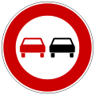

#**Traffic Sign Recognition** 

---

**Build a Traffic Sign Recognition Project**

The goals / steps of this project are the following:
* Load the data set (see below for links to the project data set)
* Explore, summarize and visualize the data set
* Design, train and test a model architecture
* Use the model to make predictions on new images
* Analyze the softmax probabilities of the new images
* Summarize the results with a written report

## Rubric Points
###Here I will consider the [rubric points](https://review.udacity.com/#!/rubrics/481/view) individually and describe how I addressed each point in my implementation.  

---
###Writeup / README

####1. Provide a Writeup / README that includes all the rubric points and how you addressed each one. You can submit your writeup as markdown or pdf. You can use this template as a guide for writing the report. The submission includes the project code.

You're reading it! and here is a link to my [project code](https://github.com/udacity/CarND-Traffic-Sign-Classifier-Project/blob/master/Traffic_Sign_Classifier.ipynb)

###Data Set Summary & Exploration

####1. Provide a basic summary of the data set. In the code, the analysis should be done using python, numpy and/or pandas methods rather than hardcoding results manually.

I used the pandas library to calculate summary statistics of the traffic
signs data set:

* The size of training set is 34799
* The size of the validation set is 4410
* The size of test set is 12630
* The shape of a traffic sign image is (32, 32, 3)
* The number of unique classes/labels in the data set is 43

####2. Include an exploratory visualization of the dataset.

Here is an exploratory visualization of the data set. It is a bar chart showing how the data is distributed among the classes for the training dataset. The visualization was done with numpy and matplotlib.pyplot.

###Design and Test a Model Architecture

####1. Data augmentation and preprocessing

I decided to use color images as the input instead of grayscale versions as I feel that color will play a significant role in the recognition and distinction of road signs. In addition to the original data, I've augmented the dataset using the following techniques, rotation, random cropping and resizing. Here's a figure depicting the various data augmentations to increase the size of the training dataset

As a last step, I normalized the image data because normalized inputs tend to produce better convergence and lead to faster learning during the gradient descent update step.

####2. Describe what your final model architecture looks like including model type, layers, layer sizes, connectivity, etc.) Consider including a diagram and/or table describing the final model.

My final model consisted of the following layers:

| Layer         		|     Description	        					| 
|:---------------------:|:---------------------------------------------:| 
| Input         		| 32x32x3 RGB image   							| 
| Convolution 5x5     	| 1x1 stride, valid padding, outputs 32x32x32	|
| Batch Normalization   |                                               |
| leaky RELU			| negative slope = 0.1							|
| Max pooling	      	| 2x2 stride,  outputs 16x16x32				    |
| Convolution 5x5     	| 1x1 stride, valid padding, outputs 16x16x64	|
| Dropout               | 0.1 discard probability                       |
| Batch Normalization   |                                               |
| leaky RELU			| negative slope = 0.1							|
| Max pooling	      	| 2x2 stride,  outputs 8x8x32				    |
| Dropout               | 0.1 discard probability                       |
| Fully connected		| 512 units        							    |
| Dropout               | 0.5 discard probability                       |
| leaky RELU			| negative slope = 0.1							|
| Fully connected       | 43 units                                      |
| Softmax				| etc.        									|
| Cross Entropy Loss    | Mutlinomial categorical cross entropy loss    |
 

####3. Training the model

To train the model, I used an Adam Optimizer with a learning rate of 0.003 and a mini batch size of 128. These hyperparameters were adjusted based on emperically checking the performance and speed of learning. The network was trained for a total of 15 epochs. After 8 epochs the improvements in the validation were very minor and very likely the training could have been stopped at 10 epochs.

####4. Approach taken to fine tune the network and improve the validation set accuracy

My final model results were:
* validation set accuracy of 89.7 %
* test set accuracy of 898 %.

An iterative approach was chosen:
* The first architecture tried had about 8 convolution layers followed by 16 layers. 
* It quickly became apparent that the network was stagnating at 79% accuracy. The network was underfitting.
* To improve the performance of the network I increased the number of layers from 16 to 32. I also added batch normalization to the convoluational layers and a leaky relu layer to allow negative gradients to propagate.
* To improve the final resuls, I chose a smaller dropout of 0.1 after each convolution layer and a dropout rate of 0.5 for the fully connected layer.
* The model's accuracy is about 90% on the validation test. However there is scope for further improvement. My intuition is that I ought to be able to add one additional convolution layer and perform more data augmentation. The model's performance on smaller or more blurred traffic signs is not quite as good and so to improve this I would consider adding in additional images of blurred traffic signs as well as zoomed out and smaller signs with shifted versions. 
* I would also try transfer learning approach with alexnet and vgg16 to see if the results improve.
 

###Test a Model on New Images

####1. Choose five German traffic signs found on the web and provide them in the report. For each image, discuss what quality or qualities might be difficult to classify.

Here are five German traffic signs that I found on the web:

  
 

The last image, speed 30 kph, is likely to present a challenge to the network as it is too small when resized to a 32x32x3 image and the background gets more real estate in the image.

####2. Here's a  snapshot of the predictions of the network

| Ground Truth         	|     Prediction	        					| Softmax Probabilities|
|:---------------------:|:---------------------------------------------:|:--------------------:|
| Double Curve          | Double Curve   								| 1.0                  |
| End of no passsing    | End of no passing 						    | 1.0                  |
| No passing			| No passing									| 1.0                  |
| Speed Limit (30km/h)	| Slippery road						 			| 0.97                 |
| Speed limit (60km/h)  | Yield     							        | 0.99

The model was able to correctly guess 5 of the 8 traffic signs, which gives an accuracy of 62.5%. For the first few images,the final model is very certain about the predictions. The last 3 images pose a challenge to the network.
The accuracy of the test set is around 90%. So the network is still likely to make mistakes in its present form. The images that the network erroed on are all ones where the traffic sign is too small compared to the background. If we leave these images out, then the accuracy is 100% which means that the network performs well on the type of images that occur in the training dataset. In order for the network to work on images of smaller traffic signs we will need to add additional images to the training dataset of this kind. The speed signs may also pose a problem because there is just one character that distinguishes each speed limit sign from the other. The other approach to improve resuls with speed signs would be to combine all speed limit signs into one category and then apply additional techniques to parse out the result. 

